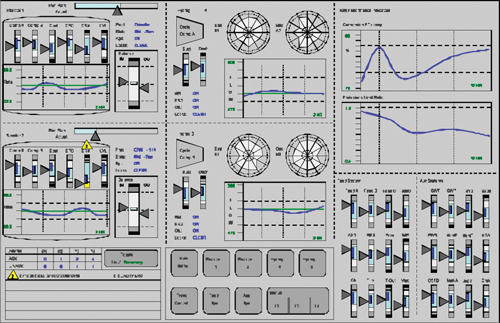



    
<h2>HMI/SCADA Systems</h2>

	

		
A <b>Human Machine Interface</b> (<b>HMI</b>), or <b>Supervisory Control and Data Acquisition</b> (<b>SCADA</b>) system is a specialized software program used to display the state of<b>industrial processes</b>, communicate with  <b>PLCs</b> to control the process and notify operators of any alarms or upsets in the process. HMI/SCADA systems play a large part in the world of <b>industrial automation</b>.

		
HMI/SCADA systems consist of a graphical interface used to display process conditions, historical process data, and alarms. The interface allows operators to control process equipment by means of a PLC. Depending on the HMI/SCADA software the system may be <b>stand-alone</b>, running on a workstation, or <b>server-based</b>, running on a central server accessible from clients via a software program or web-browser. HMI/SCADA systems typically rely on <b>scripts</b> to enable advanced functionality, allowing for code <b>re-usability</b>. Some HMI/SCADA platforms allow for the inclusion of <b>IP Cameras</b> for additional plant security, and can be integrated with various business systems to streamline <b>workflows</b>, understand <b>costs</b>, and manage <b>energy usage</b>.

	

	

		
	

	
	

		<h4 style="text-align: left;">Corso Systems HMI/SCADA Development Philosophy</h4>
		
Having spent time with every major HMI/SCADA platform, we focus on writing <b>structured</b>, <b>well-designed</b> applications. The benefit with this approach is an <b>easy</b> to understand, <b>flexible</b> system, capable of modification for <b>future</b> needs. We have <b>libraries</b> of graphics and scripts we have developed and <b>tested</b>, currently running some of the top facilities in the world, available for new systems.

		
Put simply, our goal is to build a system <b>anyone</b> can <b>maintain</b> in the future. Our customers should never feel like we are the only resource available to maintain their systems.

		
We follow the '<b>High Performance HMI</b>' development methodology, giving your operators the most useful HMI/SCADA system possible. This methodology <b>reduces</b> operator confusion during the <b>critical</b> times when things are going wrong and need to be fixed immediately. When things are functioning normally, High Performance HMI/SCADA systems give you operators the information they need in ways most useful to understand the current state of the process.

	

	
	

		<h4 >Corso Systems' HMI/SCADA Engineering Service Offerings and Experience</h4>
	
We can develop <b>new HMI/SCADA systems</b> from the ground up, and can <b>troubleshoot</b>, <b>update</b>, and <b>modify</b> existing systems anywhere in the world. We are experienced with <b>Siemens</b>, <b>Rockwell</b>, <b>Wonderware</b>, <b>Inductive Automation</b>, and <b>others</b>. We integrate HMI/SCADA systems with other devices and systems including, but not limited to, <b>predictive maintenance and CMMS systems</b>, <b>security camera systems</b>, <b>manufacturing execution systems</b>, <b>databases</b>, <b>ERP systems</b>, <b>LIMS systems</b>, and other <b>business systems</b> such as </b>shipping</b> or <b>inventory management systems</b>.

	

    
<h4>HMI/SCADA Platforms</h4>

<h4 style="text-align: left;">We speclialize in developing customized solutions to meet our clients' needs.</h4>

<h4 style="text-align: left;">If you don't see your platform listed or would like our help with finding a new one, please email one of our engineers at <a href="mailto:info@corsosystems.com?Subject=HMI%20Information%20Request">info@corsosystems.com</a>.</h4>

