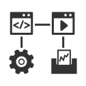



  

 

  

<h4>Corso Systems facilitates the development and implementation of technology that is flexible and scalable. Problem solving while having fun is our passion, and through years of experience in various industries, we have helped companies take their workflow to the next level through systems that work smarter.</h4>

    

      <i class="fa fa-bar-chart hdrIcon" style="font-size:32px;padding-right:10px;"></i>
    

    

      <i class="fa fa-wrench hdrIcon" style="font-size:32px;padding-right:10px;"></i>
    

    

      <i class="fa fa-hdd-o hdrIcon" style="font-size:32px;padding-right:10px;"></i>
    

    

      <i class="fa fa-globe hdrIcon" style="font-size:32px;padding-right:10px;"></i>
    

  

  

 

  

  <h2 style="text-align: left;">Turning Data Into Useful Information </h2>
  
 Most companies want to better understand their operations. The first step is collecting data, and companies tend to generate a lot of data. Often times that data is not used to its fullest potential. One way to get the full value of  your data is by implementing tools to turn that data into useful information, helping you make better decisions. We have helped companies in a variety of industries use information to make better decisions.

<h4 style="text-align: left;">Integrated</h4>

As information flows from the shop floor to the top floor it is adapted to  provide the most value at each level. People should see what is most valuable to them  with the option to drill down as needed. In an integrated facility, the data can be adapted automatically, saving time and resources. Our experience has allowed us to work with a variety companies, giving us the ability to integrate a wide array of systems.

<h2 style="text-align: left;">User Friendly</h2>
  
In today's world software is everywhere and used for just about everything. Software should make your life easier by reducing complexity with a clean interface. It should be easy to learn and give you access to what you need. We build systems that help you do your job better by getting out of the way.

<h4 style="text-align: left;">Simple</h4>

Software can be simple and powerful by giving you what you need when you need it. It should adapt to your workflow rather than forcing you to change.

<h4 style="text-align: left;">Powerful</h4>

Software is powerful when it gives you the ability to synthesize complex information into straightforward concepts. Powerful also means showing people the information they need to see in the way they need to see it.

<h4 style="text-align: left;">Better</h4>

Software is better when you want to use it. When it is designed around you and your needs it enables you to be more effective in your role.

<h2 style="text-align: left;">Automated</h2>

Automation provides consistency in process output quality. As process conditions change, adjustments to the automation system may be necessary. We have experience helping many companies automate their processes, implement, and maintain their systems.

<!--Javascript-->


